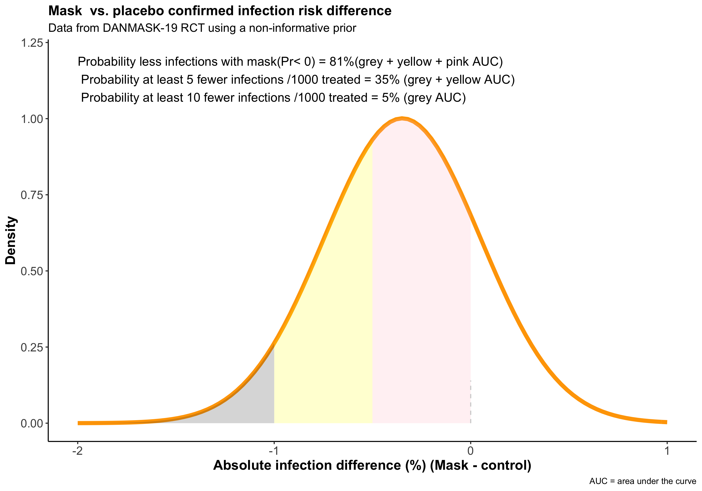
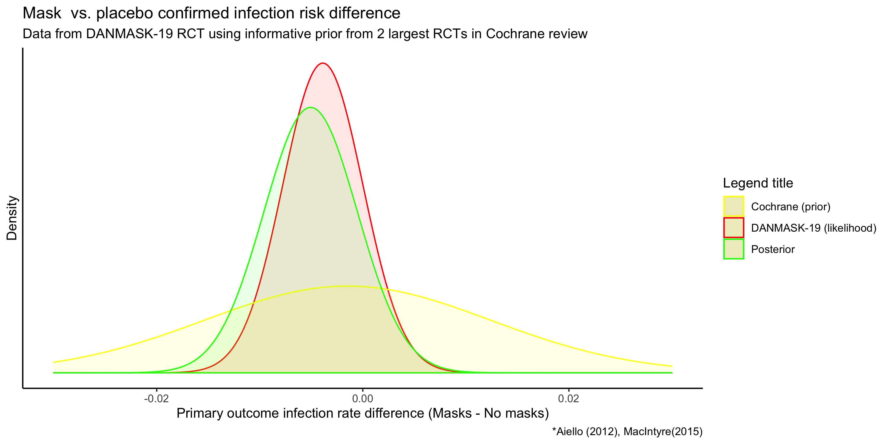

```{r setup, include=FALSE, fig.width= 12}
knitr::opts_chunk$set(echo = TRUE)
```

While there is no doubt regarding the physical, mental, and economic carnage due to severe acute respiratory syndrome coronavirus 2 (SARS-CoV-2), there is considerable debate regarding the evidence of masks to reduce its spread. At times, the debate seems governed more by partisan political views than by scientific evidence. I have commented on this issue of masks in an earlier [post](https://www.brophyj.com/post/covid-masks-and-poor-science/).    

Paradoxically, the publication Nov 18 2020 of the first randomized trial evaluating masks, [DANMASK-19](https://www.acpjournals.org/doi/10.7326/M20-6817), during the current covid-19 pandemic and a meta- analysis of older trials seems to have heightened rather than reduced the uncertainty regarding their effectiveness.      

I explored this paradox in a [BMJ opinion article](https://blogs.bmj.com/bmj/2020/11/24/covid-19-controversial-trial-may-actually-show-that-masks-protect-the-wearer/?utm_campaign=shareaholic&utm_medium=twitter&utm_source=socialnetwork) which I briefly summarize in this post.   

1. Null hypothesis significance testing can create as many [problems](https://www.tandfonline.com/doi/full/10.1080/00031305.2019.1583913) as it hopes to avoid. Main issues in poor interpretations of “negative” studies due to nullism and dichotomania.     

2. DANMASK study deemed “[negative](https://www.spectator.co.uk/article/do-masks-stop-the-spread-of-covid-19-)” but actually provides as much evidence for 33% reduction in infections as for no effect     

3. Bayesian paradigm can help. Figure shows the probability of masks preventing infections (with a non-informative prior) in the wearer is 81%, quite a different interpretation than simply a “negative” study    

4. Bayesian approach also allows interpreting DANMASK in the context of prior knowledge about masks in non-Covid settings as presented in Cochrane review. The data is consistent and robust (84% probability of benefit)    

5. Epi 101 - Don’t confuse rates with overall risk. DANMASK and previous pre-Covid mask studies reported infections avoided over 4 weeks. Not the same as risk prevented over the duration of a long (>9 mo) pandemic -> 36 (95%CI 12 -57) fewer infections per 1000 mask wearers    

6. Benefits could be greater in higher incidence setting, with better mask compliance, and if protection to others is considered   

7. Evidence is definitely not perfect but likely “good enough” given low cost and few side effects.    


