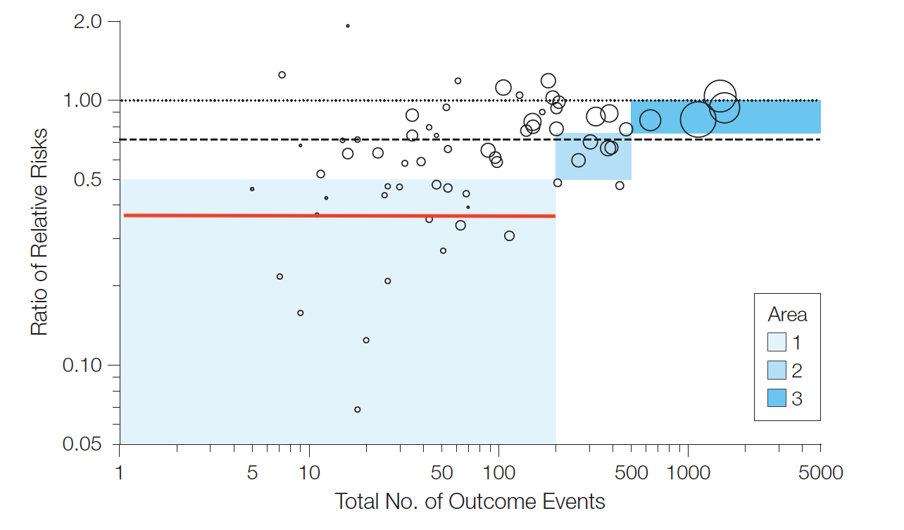

```{r setup, include=FALSE}
knitr::opts_chunk$set(echo = FALSE)
```


```{r echo=FALSE, results=FALSE, message=FALSE, warning=FALSE}
library(knitr)
library(kableExtra)
library(tidyverse)
# data
Ec<- 53 #outcome in non-expose 
Nc<-377 #total in non-expose
Ee<-28 #outcome in expose 
Ne<- 385 #total in expose

temp <- data.frame(Nc=Nc,Ec=Ec,Ne=Ne,Ee=Ee)
temp$Study <- c("MOVe-OUT")
temp <- temp[c(5,1:4)] # reorder columns

kable(temp, caption="Outcomes at 29 dyaqs") %>%
  kable_styling(bootstrap_options = "striped", full_width = F)

Ex_p_c <- temp[1,3]
Ex_p_e <- temp[1,5]
Ex_n_c <- temp[1,2]
Ex_n_e <- temp[1,4]

set.seed(1234)
#Prior is beta(1,1)
# sampling 100,000 random variables from posterior
post_Ex_p_c <- rbeta(100000, Ex_p_c + 1, Ex_n_c - Ex_p_c + 1 )
post_Ex_p_e <- rbeta(100000, Ex_p_e + 1, Ex_n_e - Ex_p_e + 1 )

# calculting posterior of differences
post_Ex_p_diff <- post_Ex_p_e - post_Ex_p_c
paste("MOVe-OUT data - Differences in outcomes between placebo and drug")
quantile(post_Ex_p_diff, probs = c(0.025, .5, 0.975))


```

On October 1 2021, Merck issed a [press release](https://www.merck.com/news/merck-and-ridgebacks-investigational-oral-antiviral-molnupiravir-reduced-the-risk-of-hospitalization-or-death-by-approximately-50-percent-compared-to-placebo-for-patients-with-mild-or-moderat/) stating that following an interim analysis  of the Phase 3 MOVe-OUT trial, 7.3% (28/385) of patients treated with molnupiravir experienced the primary endpoint (death or hospitalization through day 29), compared with 14.1% (53/377) of placebo-treated patients. The study population were non-hospitalized adult patients with mild-to-moderate COVID-19. Given the almost 50% reduction in the primary outcome (p=0.0012), it is perhaps not surprising that the press release goes on to state that  "Merck plans to submit an application for Emergency Use Authorization (EUA) to the U.S. FDA as soon as possible based on these findings and plans to submit marketing applications to other regulatory bodies worldwide."     
While definitive conclusions are impossible without examining the complete data set and seeing the final publication, one may wonder if the data are as compelling as the press release suggests.   
<br>
1.**p values overestimate the strength of the evidence** For example, if before the MOVe-OUT trial was performed, it was beleived there was a 50:50 chance of the null hypothesis (H$_o$) of no effect being true and the experiemental data resulted in a p = 0.0012 (z=3.29) as observed, then the  minimum Bayes Factor is approximately 1/190 (1/BF) and the posterior probability that  H$_o$ is true falls to 0.5% (posterior odds = Bayes factor * prior odds).  However a skeptic might say that the majority of drug trials fail and that interim results often provide over-estimates of the true effect (see below) therefore the prior odds that H$_o$ is true may be considerably higher than 50:50, perhaps more like 75:25 or even 90:10. Under those prior beliefs, the probability of H$_o$ still being true even after the MOVe-OUT trial data is 1.3% and 3.9% respectively. The MOVe-OUT results still appear strongly supportive of a benefit for molnupiravir but perhaps not quite as compelling as initially implied by p = 0.0012.    
<br>

```{r echo=FALSE, results=FALSE}
library(fragility)
frag.study(e0 = 53, n0 = 377, e1 = 28, n1 = 385)

dat <- data.frame(exp=c(rep(0,377),rep(1,385)),
outcome=c(rep(0,324), rep(1,53), rep(0,357), rep(1,28)))                

out <- glm(outcome ~ exp, data = dat, 
           family = binomial(link = "logit"))
summary(out)

rr <- exp(-.7351)
ci <- exp(-.7351 + c(-1,1) * 1.96 * 0.246)
 
#Bayes factor function
bayesF <- function(z){
  bf <- exp((z^2)/2)

}

z_score <- qnorm(.0006) #p =0.0012 so .1/2 in uppper tail so need z value for qnorm(0.0006)
cat("Maximal Bayes factor (BF) = ", bayesF(z_score))

```

2.**Impact of stopping at interim analysis** A [meta-analysis](https://jamanetwork.com/journals/jama/fullarticle/185591) has examined the results from 91 truncated RCTs with 424 matching nontruncated RCTs and concluded "Truncated RCTs were associated with greater effect sizes than RCTs not stopped early. This difference was independent of the presence of statistical stopping rules and was greatest in smaller studies." Overall the relative risk (RR) in the truncated trials was 71% of the nontruncated ones. However in smaller trials with less than 200 events the truncated trials reported RR of only 37% what was observed  in the nontruncated ones (see figure below from their publication).    


```{r, echo=FALSE, fig.align='center', out.width="100%", fig.cap="RRs vs the Total Number of Outcome Events in Truncated RCTs - Red line is average for small trials < 200 events"}

```
<br>
Of course, this does not mean the observed MOVe-OUT RR of 0.48 would be reduced by 63% (to OR = 19%) in a nontruncated trial but it does offer some idea of the potential uncertainities that can arise with trials that are stopped premarturely, even those accompanied by a very small p value.     
As a concrete example of the dangers of interim analyses, consider the randomized [PROWESS trial](https://www.nejm.org/doi/full/10.1056/nejm200103083441001) of drotrecogin alfa  (AKA activated protein C or APC) involving 1690 patients with sepsis that was stopped prematurely when it showed a 6% mortality difference (p = 0.006). The drug was approved, although later when nontruncated trials showed no benefit the sponsor elected in 2011 to withdraw the drug from the market, judging that its risks exceeded any  potential small benefits.        
<br>
3.**Fragility index (FI) as a measure of trial robustness** The FI is the minimum number of patients who would have to change their event status to turn a statistically significant result to a non-significant result. For this data, the FI = 8. In other words, a reversal in statistical significance is achieved by inversing the status of 2 events in the placebo group and 6 non-events in the experimental group. This represents a change in status in only approximately 1% of the study sample. I don't think the complete loss of statistical significance by a reversal in outcomes in only 1% of the study population provides  the necessary alacrity for early approval.    
<br>
4.**Differentiating between statistical and clinical significance** While the p value gives the probability of observing this or more extreme data given the null hypothesis, it is most often of more interest to calaculate the inverse probability, namely the probability of a hypothesis given the data. This inverse probability moves inference into the realm of Bayesian statistics. The achilles heel of Bayesian is felt by some to be its requirement of a prior distribution. To minimize the impact of the prior, one can choose a non-informative one whereby the final (posterior) probability is determined uniquely by the observed data. The probability distribution function (PDF) for the difference between molnupiravir and placebo from MOVe-OUT using a non-informative prior is plotted below.    
```{r echo=FALSE, fig.align='center', out.width="100%"}
fig1a <- ggplot(data.frame(x = c(-13, 1)), aes(x = x)) +
        stat_function(fun = dnorm, args = list(mean(post_Ex_p_diff*100), sd(post_Ex_p_diff*100)),  colour = "orange", size=2) +
        scale_x_continuous(name = "Primary outcome difference  (molnupiravir - placebo)") +
        scale_y_continuous(name = "Density") +
        labs(title="MOVe-OUT PDF for primary outcome (death + hospitalizations)",
             subtitle = "Non-informative prior", caption="AUC = area under the curve\n     PDF = probability density function") +
        geom_vline(xintercept=mean(post_Ex_p_diff*100)) +
        annotate("text", label = "Black vertical line = mean outcome \n difference (6.7%) decreased with molnupiravir", x = -5.5, y = .16, color = "black") +
        annotate("text", label = "Grey AUC = probability (95%) \n molnupiravir < placebo outcome by > 3%", x = -5, y = .10, color = "black") +
         annotate("text", label = "Grey + yellow AUC = probability (99.9%) \n molnupiravir< placebo outcome", x = -3, y = .04, color = "black") +
        theme_classic() +
        stat_function(fun = dnorm, args = list(mean(post_Ex_p_diff*100), sd(post_Ex_p_diff*100)), xlim = c(-13,-3), geom = "area", alpha = 0.2) +
        stat_function(fun = dnorm, args = list(mean(post_Ex_p_diff*100), sd(post_Ex_p_diff*100)), xlim = c(-3,1), geom = "area", alpha = 0.2, fill = "yellow") 

fig1a
```
One of the main advantages of this approach is that it assists in differentiating between statistical and clinical significance. We are less interested in the probability that there are simply fewer events with molnupiravir and more interested in the probability that this difference exceeds some clinically meaningful threshold. Thus while there is a 99.9% probability of fewer events with molnupiravir, there is only a 95% probability that the benefit is as large as a 3% decrease in the combined death & hospitalization outcome. Again this speaks to the high probability of benefit with molnupiravir but there is less certainty as to the magnitude of any relevant clinical benefit.    
<br>
5.**Safety** There were no concerning safety signals noted from the MOVe-OUT trial but with only 775 patients there was  insufficient power to rule out potential side effects.    
<br>
6.**Generalizability** Recruitment in Latin America, Europe, and Africa accounted for 55%, 23% and 15% of the MOVe-OUT study population, respectively. This leaves at most 7% or approximately 50 patients randomized from North America centers. Are we certain that drug effects will not vary across these different populations with their varying ancillary treatments and health care systems? Perhaps there is no no between country variation but this is another point of uncertainty that still requires some resolution.        
<br>
7.**Cost** Given a 5 day treatment is expected to cost about $700 and that Merck has projected to produce 10 million courses of treatment in 2021, the cost of molnupiravir could reach several billion dollars, highlighting again the need for further studies to reduce the uncertainty regarding the magnitude of any benefits, of any risks, and the generalizability of the results.     
<br>
In conclusion from my perspective, although these initial trial results are very promising, it would seem prudent to request a confirmation study, ideally mainly in a North American population, before committing a large amount of resources to this drug. In most healthcare systems, resources are not a continually expanding commodity and a commitment to this drug will come with a reduction of resources elsewhere and hence the need to make maximally informed decisions.


