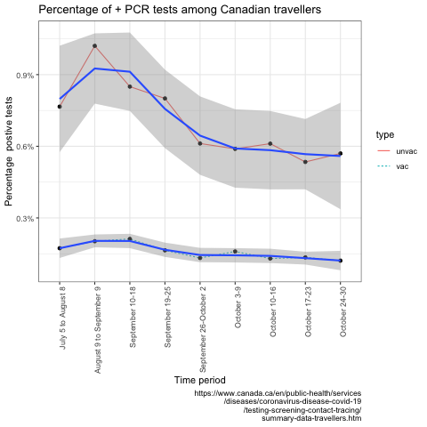

```{r setup, include=FALSE}
knitr::opts_chunk$set(echo = FALSE)
```

At present, guidelines require mandatory molecular based COVID-19 tests for all travellers entering Canada regardless of their vaccination status. Ever wonder about the (cost) effectiveness of this policy?

Here is data from [Canada Public Health](https://www.canada.ca/en/public-health/services/diseases/coronavirus-disease-covid-19/testing-screening-contact-tracing/summary-data-travellers.htm) for July  to end of October 2021.

<center>


</center>

This shows that the average test positivity rate for vaccinated travellers is approximately 0.16% or 16 in 10,000. With a laboratory cost of approximately 200 dollars for a RT-PCR test, the cost of identifying these 16 individuals is approximately 2,000,000 dollars. Other costs to this strategy include the time wasted arranging for testing and the illusory sense of security associated with a negative RT-PCR test, given the high false negative rate in the first days following exposure. At what level of detection does this policy of screening all vaccinated travellers no longer make sense? Simply counting those identified without quantifying the overall benefits and costs seems inane. Will we maintain this policy if detection rates fall to 10 in 10,000? 5 in 10,000? 1 in 10,000? What criteria will we use, the most risk averse imaginable? In the realm of clinical medicine, testing of individuals whose prior probability of disease is 0.1%, or even 1%, is strongly discouraged as being inappropriate. Why then should public health get a free pass on this unselective testing?

Overall during the past 4 months, returning vaccinated Canadian travellers (605,000) have spent approximately 120 million dollars on testing to identify a total of 1031 RT-PCR positive individuals. In other words, 120,000 dollars is being spent to detect each positive individual. The benefits from identifying these largely asymptomatic individuals are unknown as their infectious and transmissibility rates remain undefined. One could reasonably speculate that rather than imposing this unproven testing strategy on vaccinated travellers, a simple health tax of $100 - 200 per traveler with a less restrained allocation policy allowing money to flow to both COVID or non-COVID health conditions would purchase more health benefits.

One might wonder how this mandatory sampling of vaccinated travellers would compare with random sampling of the general population. The [REACT study](https://doi.org/10.1371/journal.pmed.1003777) from the UK randomly sampled 146,701 individuals in Jan 2021 and discovered 1251 positive cases, a rate of 0.9%, or almost 6 times the current rate in vaccinated Canadian travellers. Now this data comes from a different time and different country so its comparability to current Canadian data is close to nil. Nevertheless, it does raise the question of whether the yield of testing vaccinated air travellers is any better than a policy of random testing of the general population, a procedure that is not presently recommended

Imposing a national policy simply because it identifies a few extra cases without considering the total implications of the policy lacks intellectual rigour and justification. The positivity yield in non-vaccinated travellers is about 4 fold higher than in the vaccinated cohort. Similarly, in random sampling of the general population positivity yields are increased about 6 fold in symptomatic individuals. More detailed modeling with enhanced contemporary local population data, is necessary to make optimally informed decisions. However, a targeted testing of unvaccinated or symptomatic travellers, instead of the current unselected approach, may well represent a first pass, more sensible, and cost-effective approach to Covid detection. Replacing the cost and inconvenience of indiscriminate Covid testing in vaccinated travellers with a simple health tax would likely purchase increased societal health benefits over the present capricious system.
