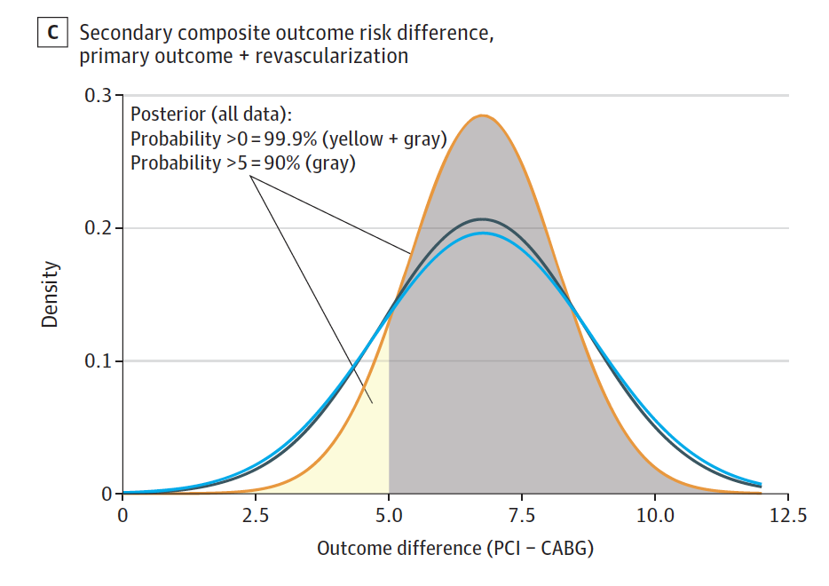

---

title: "Trade-Offs Versus Obfuscation"
subtitle: ""
summary: ""
authors: []
tags: []
categories: []
date: 2021-11-26T21:37:19-05:00
lastmod: 2021-11-26T21:37:19-05:00
featured: false
draft: false

# Featured image
# To use, add an image named `featured.jpg/png` to your page's folder.
# Focal points: Smart, Center, TopLeft, Top, TopRight, Left, Right, BottomLeft, Bottom, BottomRight.
image:
  caption: ""
  focal_point: ""
  preview_only: false

# Projects (optional).
#   Associate this post with one or more of your projects.
#   Simply enter your project's folder or file name without extension.
#   E.g. `projects = ["internal-project"]` references `content/project/deep-learning/index.md`.
#   Otherwise, set `projects = []`.
projects: []
---

On Nov 15 2021, the Lancet published an individual patient data (IPD) meta-analysis ["Percutaneous coronary intervention with drug-eluting stents versus coronary artery bypass grafting in left main coronary artery disease"](https://www.thelancet.com/journals/lancet/article/PIIS0140-6736(21)02334-5/fulltext) that concluded\
  *Among patients with left main coronary artery disease and, largely, low or intermediate coronary anatomical complexity, there was no statistically significant difference in 5-year all-cause death between PCI and CABG, although a Bayesian approach suggested a difference probably exists (more likely than not \<0·2% per year) favouring CABG. There were trade-offs in terms of the risk of myocardial infarction, stroke, and revascularisation. A heart team approach to communicate expected outcome differences might be useful to assist patients in reaching a treatment decision.*     The paper is remarkable for several reasons:    
1. In addition to standard frequentist analyses, it included a Bayesian assessment of total mortality.     
2. The main text of the paper did not consider the composite primary endpoint, generally a composite of several cardiovascular outcomes including death, myocardial infarction, stroke or revascularizations, of these trials but reported only the individual endpoints.    
3. The conclusion speaks of **trade-offs** in the risk of myocardial infarction, stroke, and revascularisation implying there are supporting data for both interventions which does not accurately reflect the reality.   
4. While most would agree with the concept of heart team approach, this is only valid if fully transparent evidence is provided and by relegating the primary endpoint to supplemental material and excluding this from the more informative Bayesian analyses, the authors risk undermining their recommendation.

## Bayesian approach

The Bayesian analysis is helpful as it moves discussion away from null hypothesis significance testing and towards the parameter estimation of the difference in mortality between the 2 approaches. I published a Bayesian analysis of the same datasets, using aggregate data,in [JAMA Internal Medicine](https://jamanetwork.com/journals/jamainternalmedicine/fullarticle/2766594) 18 months ago and although not referenced in the current article found the exact same probability for increased mortality with CABG. Given that one of the authors heavily criticized this previous work as being biased [with analytical errors and omissions](https://www.tctmd.com/news/new-excel-analysis-reignites-debate-over-pci-left-main-cad), I am thankful for the validation of my earlier results. However, given that this IPD meta-analysis would also include a systematic review, one could wonder if ignoring this previous work  was not an intentional attempt at its scotomization.      

## Which endpoint

It is surprising that the authors elected to focus their IPD not on the primary endpoint of the trials which was generally a composite of total mortality, myocardial infarction, stroke and, depending on the study, ischemia driven revascularization either as a primary or secondary outcome, but rather on the individual components of the composite outcome. It is only deep in the supplemental material that the results of the composite outcome can be found **without any additional Bayesian analysis**. It would be appreciated if the authors could confirm the earlier results of a 90% probability that the composite endpoint, including repeat revascularizations, is increased by at least 5 extra events per 100 patients treated with PCI.\
     

## Trade-offs

The authors state "“There were **trade-offs** in terms of the risk of myocardial infarction, stroke, and revascularisation." In addition, to the 86% probability of increased mortality at 5 years, the authors report statistically significant increases of 135% (HR 2·35 (1·71–3·23)) in spontaneous myocardial infarction and 78% (HR 1·78 (1·51–2·10) in the need for repeat revascularizations with PCI. Provided the patient has a reasonable life expectancy, all outcomes favor CABG except for stroke and that difference is not statistically significant (HR 0·84 (0·59–1·21)). In absolute terms, for every 1000 patients treated with PCI versus CABG, one would expect 35 more patients to have a spontaneous MI & 76 more to undergo repeat revascularization over 5 years, with no discernible difference in stroke. Therefore the question arises what **'trade-offs'** are the authors referring to? Allowing the authors to highlight the increased stroke risk at 1 year with CABG seems more like a failure of the peer review system as this outcome was never prespecified in any of the original studies and seems purely data driven.    

## Heart team approach   

The authors recommend a heart team approach to communicating this information and I suspect that the medical community is largely in agreement, provided the totality of the evidence is presented in a transparent and unbiased manner, ideally incorporating the additional advantages of Bayesian analyses. Despite  four of the 15 authors coming from surgical backgrounds, one may question if this article is an objective and nonpartisan accounting of the evidence. This reader is left with the impression of a cabal of conflicted cardiologists attempting to obfuscate the evidence, aided and abetted by an ineffective peer review system.

