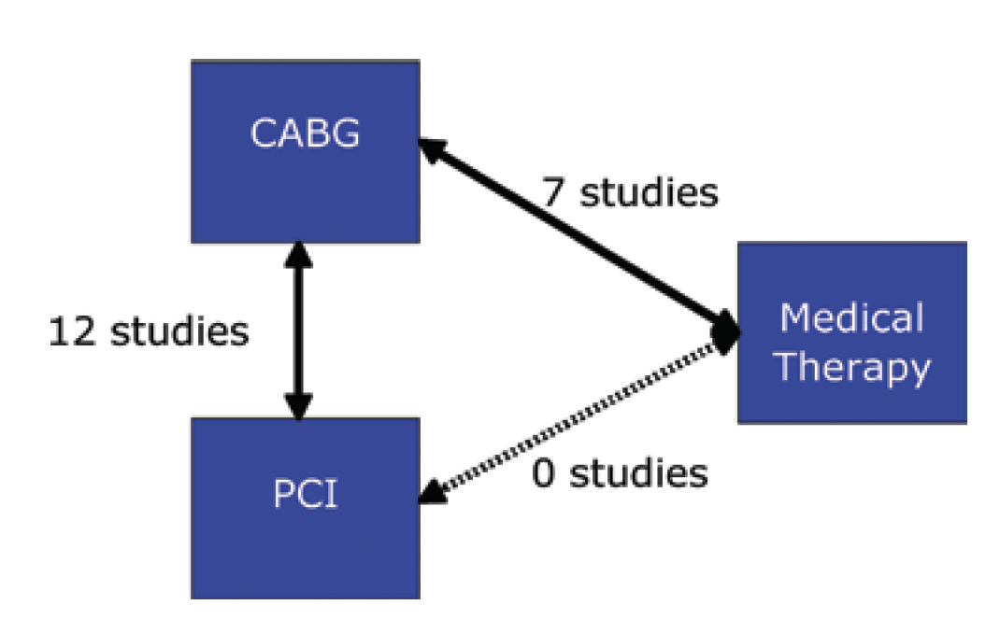

Good scientific writing is characterized by clarity of thought and often buttressed by appropriate peer reviewed references. This is of extreme importance when the scientific writing is that of consensus guidelines. But are references always faithfully quoted and even if that is true, are the original references in fact accurate and truthful?

Consider the recent [AHA / ACC Guidelines for Coronary Artery Revascularization. According to these guidelines](https://www.jacc.org/doi/10.1016/j.jacc.2021.09.006), class 1 recommendation arises when benefits \>\>\> risks and class 2a when benefits \>\> risks. In the section dealing with left main disease, we find the above recommendation.

What is the evidence supporting the claim "PCI is reasonable to improve survival"? [Reference 9](https://pubmed.ncbi.nlm.nih.gov/23674397/) is a Bayesian cross-design and network meta-analysis of 12 studies (4 RCTs and 8 observational studies) comparing CABG with PCI and of 7 studies (2 randomized clinical trials and 5 observational studies) comparing CABG with medical therapy. This 2013 publication had a primary outcome of 1 year mortality and concluded;\
1) no mortality difference between CABG and PCI\
2) medical therapy is associated with higher 1-year mortality than PCI

So while the guideline writers have accurately quoted the reference, the actual publication seems more smoke and mirrors than hard evidence. Accepting the authors' results that the posterior median for the comparative PCI / CABG mortality summary OR was 1.04 with 95% Bayesian credible interval 0.74 to 1.39 does **not** however provide evidence for concluding there is no mortality difference between the 2 techniques -- unless, as first observed by the late George Diamond, the [original Bayesian cardiologist](https://www.ajconline.org/article/S0002-9149(16)30024-8/pdf), one believes potential relative mortality increases from 26% in favor of one technique to 39% in favor of the other are [clinically unimportant](https://www.ahajournals.org/doi/10.1161/CIRCULATIONAHA.113.004321).

The inability of these results to lead to definitive conclusions is illustrated by the following plot of this probability density function.

```{r graph, message=FALSE, warning=FALSE, echo=FALSE, eval=FALSE}
library(tidyverse)
ggplot(data.frame(x = c(0.5, 1.75)), aes(x = x)) +
  stat_function(fun = dnorm, args = list(1.04, .1658), colour = "deeppink") +
  scale_x_continuous(name = "OR") +
  scale_y_continuous(name = "Density") +
  labs(title="PDF of  1 year mortality OR (PCI/CABG) ",
       subtitle = "Based on 2013 network meta-analysis", caption="AUC = area under the curve\n     PDF = probability density function") +
  geom_vline(xintercept=1.04) +
  annotate("text", label = "Black vertical line \n = summary OR", x = 1.1, y = 0.5, color = "black", hjust=0) +
  annotate("text", label = "Grey AUC 25% proportional \n OR mortality increased by at least 15% with PCI", x = 0.75, y = 1.5, color = "black", hjust=0) +
  annotate("text", label = "Grey + yellow AUC 60% proportional \n OR mortality increased with PCI", x = 0.75, y = 2.0, color = "black", hjust=0) +
  theme_classic()+
  stat_function(fun = dnorm, args = list(1.04, .1658), xlim = c(1.15,1.7), geom = "area", alpha = 0.2) +
  stat_function(fun = dnorm, args = list(1.04, .1658), xlim = c(1,1.15), geom = "area", alpha = 0.2, fill = "yellow") 

ggsave("graph.png", dpi = 300, width = 8, height = 4)  


```

          

This demonstrates that the probability of increased mortality with PCI is 60% and 25% probability that the mortality OR is increased by at least 15% compared to CABG.

Moreover, there are other notable limitations to this publication which one may have expected an illustrious group of guideline writers to have noticed. First according equal weighting given to RCTs and observational studies may be questioned. Second an important quality element in a network meta-analysis is to assure consistency between the observed direct effects and the calculated indirect effects. However according to their figure below, there were in fact **NO** studies, observational or randomized, comparing PCI to medical therapy rather this OR was calculated only by considering the indirect evidence coming from studies comparing CABG to medical therapy and CABG to PCI.

      

Another major limitation to the use of this publication as a reference is that the outcome was mortality at 1 year and longer-term mortality is clearly important and now available from 5-year follow-up studies from 4 RCTs. Why were these very available 5 year comparative data not considered? Could it be because new Bayesian analyses of these RCTs show compared to CABG a [85% probability of increased mortality with PCI & 98% probability \> 4 extra composite events / 100 PCI treated patients](https://jamanetwork.com/journals/jamainternalmedicine/fullarticle/2766594).

A "squeezing" of the difference between CABG and PCI for left main disease is also occurring via a downgrading of the strength of the CABG recommendation to level of evidence (LOE) B-R, defined as a moderate quality single RCT or moderate quality meta-analysis. In fact [reference 10](https://pubmed.ncbi.nlm.nih.gov/7914958/) supporting a CABG mortality benefit over medical therapy comes from a meta-analysis of 7 RCTs including 3 large ones of undisputable quality. The LOE supporting CABG in left main should definitively have been scored A. **One could therefore reasonably argue that there has been a systematic misuse of references to attempt to narrow the difference between CABG and PCI in the treatment of left main disease.**

More disconcerting than the questionable interpretation of the left main data in the body of the guideline text, is the slippery path towards complete equivalence between the revascularization techniques as articulated on page 1 of the "Top 10 Take-home Messages" in the [guidelines document](https://www.jacc.org/doi/10.1016/j.jacc.2021.09.006). Message #3 casts aside all pretense to evidence, objectivity and nuance stating "Percutaneous revascularization is a reasonable option to improve survival, compared with medical therapy, in selected patients with low to medium anatomic complexity of coronary artery disease and left main disease that is equally suitable for surgical or percutaneous revascularization."
