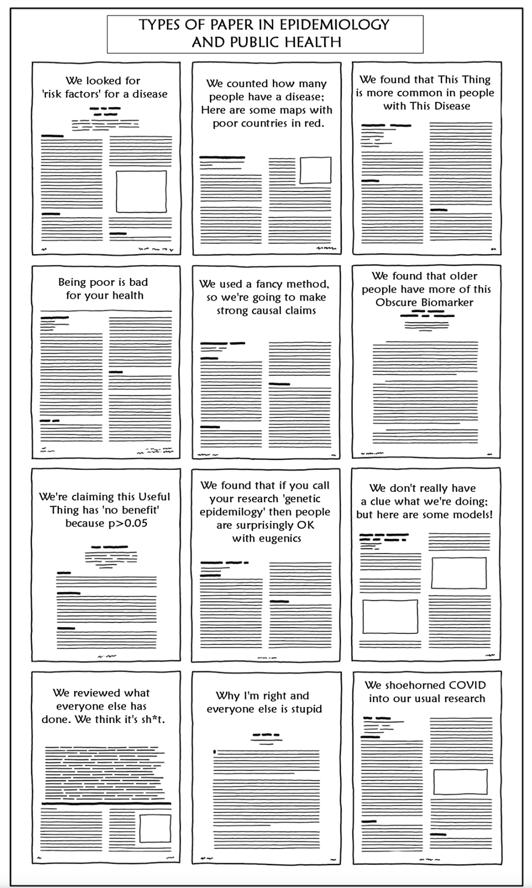

I recently reviewed a paper with 18 authors which reached a final conclusion of no morality difference between 2 contrasts (RR 1.0, 95% CI 0.5-2.0). Now this is an obviously faulty interpretation that mixes ["absence of evidence with evidence of absence"](https://www.bmj.com/content/311/7003/485).\
  This got me thinking about scientific authorship and raised several existential questions.\
1. Are all 18 authors statistically incompetent or is it only the 1 or 2 authors who probably did the majority of the work that are deficient? 2. If it is only 1-2 authors who are statistically incompetent, then what of the other 16-17 authors? Did they simply not bother to critically read a manuscript to which they signed names?\
3. Do these individuals, and by extension clinicians in general, know what constitutes authorship?\
4. How likely is it that these 18 individuals all meet authorship criteria?\
5. How seriously do journals view authorship criteria and do they take any measure towards verification?\
  The International Committee of Medical Journal Editors (ICMJE) have produced an article that is helpful in defining the role of authors and contributors which can be found [here](https://www.icmje.org/recommendations/browse/roles-and-responsibilities/defining-the-role-of-authors-and-contributors.html) and assists in answering some of the above questions. The documents underscores that \
[**"authorship confers credit and has important academic, social, and financial implications. Authorship also implies responsibility and accountability for published work."**]{style="color:darkred"}\
  The ICMJE document recommends that authorship be based on the following 4 criteria:\
1. Substantial contributions to the conception or design of the work; or the acquisition, analysis, or interpretation of data for the work;  
[**AND**]{style="color:darkred"}\
2. Drafting the work or revising it critically for important intellectual content;\
[**AND**]{style="color:darkred"}\
3. Final approval of the version to be published;\
[**AND**]{style="color:darkred"}\
4. Agreement to be accountable for all aspects of the work in ensuring that questions related to the accuracy or integrity of any part of the work are appropriately investigated and resolved.\
 

The ICMJE document also mentions several non-authorship contributions including one that is perhaps especially germane for clinicians [**"provided and cared for study patients"**]{style="color:darkred"}\
 

So returning to my existential questions;\
1. I don't know the answer but prefer to believe that the problem of statistical incompetence involved all 18 authors, although about 75% of respondents to my twitter poll believed the [opposite](https://twitter.com/brophyj/status/1599497771094282241) (see next point as to why I prefer this option)\
2. I find it preferable to believe in a general problem of statistical incompetence, which is correctable with simple educational initiatives, over the alternative hypothesis of a lack of integrity, which seems more difficult to readily address.\
3. I strongly doubt that most authors are aware of the ICMJE authorship criteria\
4. I think the probability of all 18 meeting the authorship criteria is about zero.\
5. My personal experience, admittedly perhaps somewhat selected and limited, suggests that authorship criteria is not of major concern for journal editors.\
  
Not sure where this little rant takes me, other than to state the obvious that medical publishing needs to pay more attention to authorship criteria to assure its overall scientific quality, credibility and accountability.
   
Alternatively, the message about authorship and the quality of the associated science is perhaps better captured by a [XKCD](https://twitter.com/xkcd/status/1387509188310491137) inspired cartoon that has been adapted for publications in [epidemiology](https://twitter.com/PWGTennant/status/1387734254960975881)

  
