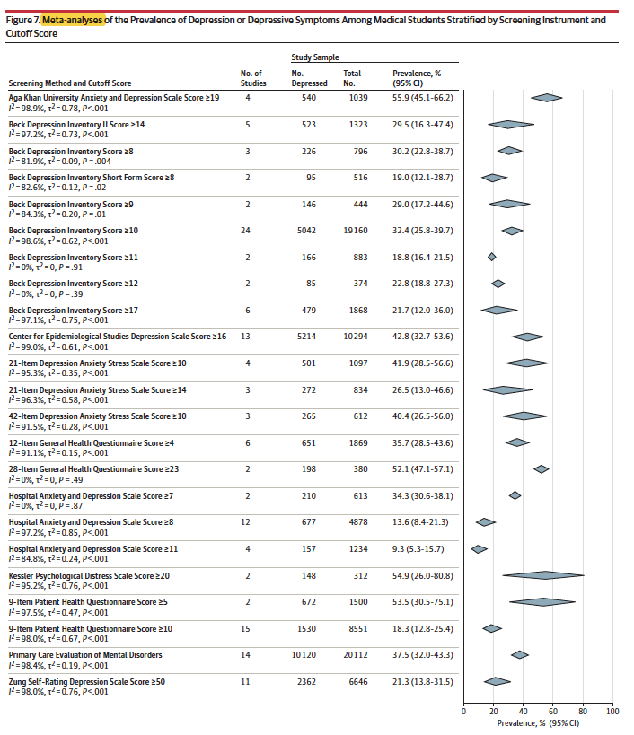
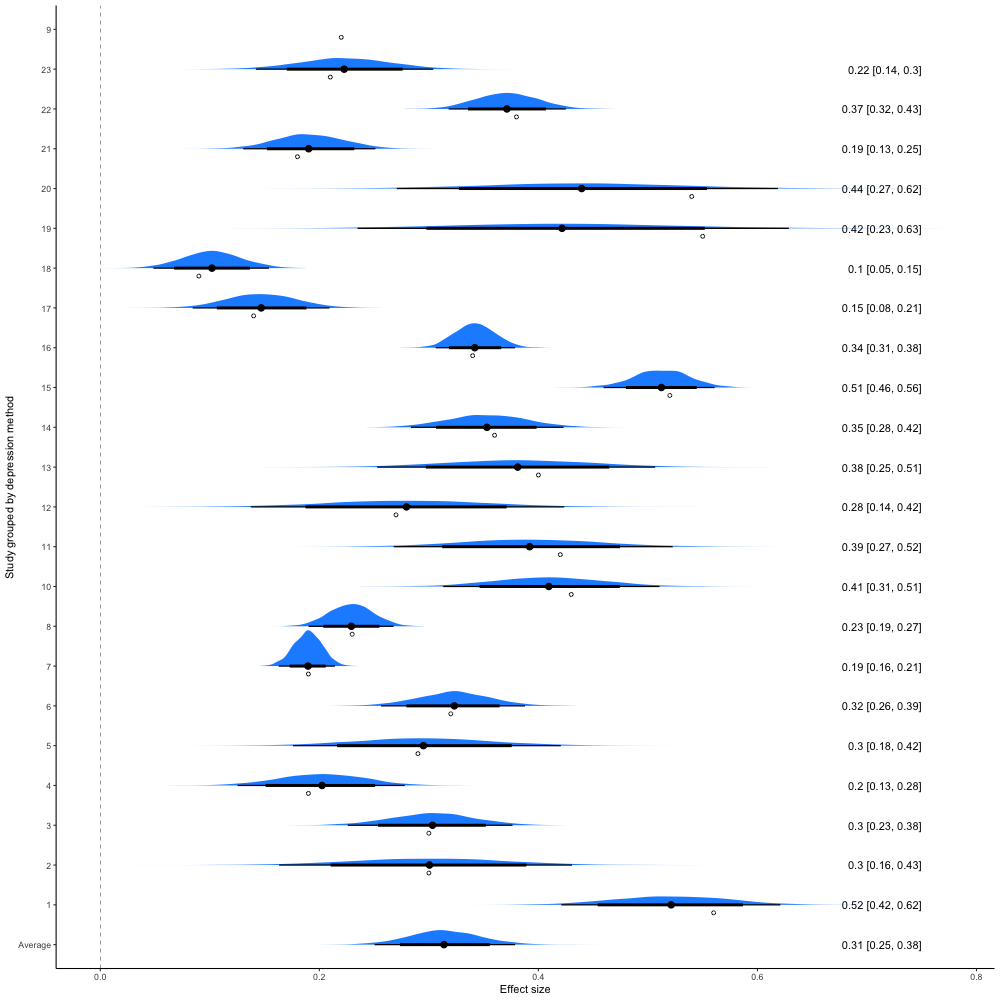

```{r echo=FALSE,  message=FALSE, warning=FALSE, include=FALSE, results='hide'}
knitr::opts_chunk$set(echo = FALSE)
options(scipen = 1, digits = 3)
pander::panderOptions('keep.trailing.zeros', TRUE)

library(here)
library(tidyverse)
library(knitr)
library(patchwork)
library(gt)

```

### Background

I am again this year teaching a small group learning course on critical appraisal for MPH students using a unique format.
Each group is divided into three smaller subgroups of four or five students.
The first subgroup received only an introduction to the problem, and without looking at the chosen article, discusses their choice of study design to address the problem.
The second subgroup received only the published abstract and comments on what details they would expect to see in the full article.
The third subgroup read the whole article and in addition to highlighting its strengths and limitations tried to answer queries raised by the first 2 groups.
The goal is to not only improve critical appraisal skills but also to think about research questions, designs and the necessary compromises that are often required in research.
Hopefully this adds another dimension to typical journal clubs where either an article in uncritically endorsed enthusiastically or trashed unmercifully.\
<br> One of the articles was this [2016 JAMA article](https://jamanetwork.com/journals/jama/fullarticle/2589340) was a systematic review of the prevalence of depression or depressive symptoms among medical students.
The data were extracted from 167 cross-sectional studies (n=116628) and 16 longitudinal studies (n=5728) from 43 countries.
The authors state they followed the Preferred Reporting Items for Systematic Reviews andMeta-analyses and Meta-analysis of Observational Studies in Epidemiology reporting guidelines.
They reported overall pooled crude prevalence of depression or depressive symptoms was 27.2% (37933/122356 individuals; 95% CI, 24.7% to 29.9%, $I^2$=98.9%) and concluded the following <br> <br>

```{r out.width="110%"}
include_graphics("images/conclusions.png")
```

Leaving aside some contextual issues such as\
- the reliability of self reporting as opposed to a structured diagnostic interview\
- the ability of screening tools to accurately diagnosis depression (low positive predictive values)\
<br> I think it is important to take the time to reflect on the statistical models and their proper interpretation.

### Statistical models in meta-analysis

The authors reported using a random effects model.
What does this mean and what the implications?\
A meta-analysis is actually nothing more than a mixed model, which is itself an extension of simple regression model that contains both explained (fixed) and unexplained (random) elements through the use of variance components.\
First the fixed effect, where the variance is the sampling variance for each study where the studies are assumed to all arise from one common distribution.
Graphically, this is displayed as follows where the distribution remains centered for each study and its spread it determined by the respective variances.
<br> <br>

```{r out.width="100%", fig.align='center'}
include_graphics("images/FE.png")
```

<br> <br> A typically more realistic random effects model considers not only this **within** sample variation but acknowledges it is unlikely that individual studies are identical and consequently also exhibit **between** study variation, as measured by the $I^2$ statistic, as shown below <br> <br>

```{r out.width="100%", fig.align='center'}
include_graphics("images/I2.png")
```

IOW, the individual studies may be considered as drawn from a supra-population distribution of potential studies, as indicated by the green curve above and blue curve below\
<br> <br>

```{r out.width="50%", fig.align='center'}
include_graphics("images/RE.png")
```

### Return to the JAMA article

Recall the results of an overall pooled crude prevalence of depression or depressive symptoms was 27.2% (37933/122356 individuals; 95% CI, 24.7% to 29.9%, $I^2$=98.9%).

#### Some general caveats

A rough guide to $I^2$ interpretations is as follows:\
0% to 40%: might not be important;\
30% to 60%: may represent moderate heterogeneity\
50% to 90%: may represent substantial heterogeneity\
75% to 100%: considerable heterogeneity\
What does this mean?\
It means if we are combining studies to compare apples to oranges and start including studies that are comparing apples to bananas, apples to grapes and oranges to pineapples, etc we are to end up with a fruit salad rather than an understanding of the original comparison being sought (leaving aside the possibility of performing a network meta-analysis).
Even if only apple versus orange studies are included, if they are of poor quality where perhaps the "appleness" or "orangeness" has been poorly measured we are unlikely to get reliable results.
Summarizing,\
[- GIGO (garbage in - garbage out)\
- excessive unexplained heterogeneity = fruit salad\
]{style="color: red;"}

#### Analyses

Consider their Figure 7 (chosen since the 183 studies have been grouped into 23 groups making data extraction more manageable).
<br> <br>

```{r out.width="50%", fig.align='center'}

```

[Question:]{style="color: red;"} Does this Figure represent a meta-analysis?\
[Answer:]{style="color: red;"} Given that a meta-analysis is the statistical combination of the results of multiple studies to quantify the effect size across all of the studies, and given its absence (as well as any measure of the combined variation), it is hard to label this Figure a meta-analysis.\
Here is a Figure that does include the desired measures.

```{r echo=FALSE, message=FALSE, warning=FALSE, eval=FALSE}
library(tidyverse)
library(metafor) # nonBayesian MA with metafor package
#Book1 <- read_excel("Book1.xlsx")
Book1 <- read.csv("Book1.csv", header=TRUE)
Book1$method <- as.character(Book1$method)
res <- rma(data = Book1, yi = mean, sei = sd, slab = Book1$method)

forest(res, addpred=TRUE, header=TRUE, shade="zebra")

# 95% CI/PI - pred <- predict(res,  digits=2)
# summary - summary(res)
```

The combined effect shows a results that is comparable with the reported depression prevalence of 27.2% (95% CI, 24.7% to 29.9%) with the difference due to the original analysis not grouping the 183 studies.\
[Question:]{style="color: red;"} What is the dotted line and what does it represent?\
[Answer:]{style="color: red;"} This is known as the prediction interval.
Remember that in a random effects model the studies come from an over-riding population distribution and the 95% CI of this distribution is the prediction interval.
Therefore the next study would come from a draw from this distribution and **NOT** from a draw of distribution of the mean effect shown in the line above.

```{r echo=FALSE, message=FALSE, warning=FALSE, out.width="100%", eval=FALSE}
library(meta)
library(grid)
m.gen <- metagen(TE = mean,
                 seTE = sd,
                 studlab = method,
                 data = Book1,
                 sm = "SMD",
                 fixed = FALSE,
                 random = TRUE,
                 method.tau = "REML",
                 hakn = TRUE)

forest.meta(m.gen, 
           # sortvar = TE,  if want to order by effect size
            prediction = TRUE, 
            print.tau2 = FALSE,
           # leftcols = c("studlab","m.gen$sm", "seTE"),
            leftlabs = c("Method","Prevalance","sd"))
grid.text("Prevalence of Depression or Depressive Symptoms Among Medical Students",
       .5, 1.2,  gp=gpar(cex=1.5))
grid.text("Stratified by Screening Instrument (Figure 7)", .5, 1.1,  gp=gpar(cex=1.5))
```

```{r}
include_graphics("images/metaplot.png")
```

[Question:]{style="color: red;"} What is probability of the prevalence of depression in the next study (medical school)?\
[Answer:]{style="color: red;"} Although 95% CI are often interpreted as probability intervals, this is actually incorrect.
To obtain probability statements one needs to switch to a Bayesian paradigm.
This is beyond the scope of this presentation but fortunately, given the large amount of available data, little error is introduced by not doing the formal Bayesian analysis.
This is shown by the figure below, produced by a Bayesian analysis with vague priors, which gives essential the same result as the frequentist analysis.

```{r echo=FALSE, message=FALSE, warning=FALSE, out.width="100%", eval=FALSE}
#Bayesian - approach 1 with bayesmeta package
Book1.es <- escalc(measure = "RR", yi=mean, sei=sd, data = Book1)
# forestplot(Book1.es)
brm1 <- bayesmeta::bmr(y=Book1.es$yi, sigma = sqrt(Book1.es$vi), tau.prior = function(t){dhalfnormal(t, s=0.5)})
brm1 # gives only group level effect
forestplot(brm1)

#Bayesian better approach with brms package

brm2 <- brm(mean | se(sd) ~ 1 +(1|method), # brm(mean | se(sd) ~ 1 would give fixed effect
            data = Book1,
            cores = 4, refresh=0,
            file = "mafile2") # to read back into r use brm2 <- readRDS("mafile2.rds")

#strangely doesn't want to give a result for number 9

summary(brm2) # population is the overall mean that we estimated
pp_check(brm2)
# ranef(brm2)

plot(brm2)
cairo_pdf("brm2.pdf", width = 6, height = 6, family = "Arial")
plot(brm2, digits = 2, base_size = 10)
dev.off()

# https://mjskay.github.io/tidybayes/articles/tidy-brms.html
library(tidybayes)
tidybayes::get_variables(brm2)
g <- brm2 %>%
     spread_draws(b_Intercept, sd_method__Intercept)

brm2 %>%
  spread_draws(b_Intercept, sd_method__Intercept) %>% # wide format
  median_qi()

brm2 %>%
  gather_draws(b_Intercept, sd_method__Intercept) %>% # long format
  median_qi()

temp <- brm2 %>%
  spread_draws(r_method[study,term]) #gets draws for all studies

post.samples <- as_draws(brm2)
names(post.samples)

######## plots

# Study-specific effects are deviations + average
out_r <- spread_draws(brm2, r_method[study,term], b_Intercept) %>% 
  mutate(b_Intercept = r_method + b_Intercept) 
out_r$study <- factor(out_r$study)
# Average effect
out_f <- spread_draws(brm2, b_Intercept) %>% 
  mutate(study = "Average")

# Combine average and study-specific effects' data frames
out_all <- bind_rows(out_r, out_f) %>% 
  ungroup() %>%
  # Ensure that Average effect is on the bottom of the forest plot
  mutate(study = fct_relevel(study, "Average")) #%>% 
# tidybayes garbles names so fix here
# mutate(study = str_replace_all(study, "\\.", " "))
# Data frame of summary numbers
out_all_sum <- group_by(out_all, study) %>% 
  mean_qi(b_Intercept)
# Draw plot
g_all <- out_all %>%   
  ggplot(aes(b_Intercept, y=fct_relevel(study,"Average", "1", "2", "3","4", "5", "6",
                               "7", "8", "10", "11", "12", "13", "14", "15","16", "17", "18",
                                                  "19", "20", "21","22", "23"))) +
  # Zero!
  geom_vline(xintercept = 0, size = .25, lty = 2) +
  stat_halfeye(.width = c(.8, .95), fill = "dodgerblue") +
  # Add text labels
  geom_text(
    data = mutate_if(out_all_sum, is.numeric, round, 2),
    aes(label = str_glue("{b_Intercept} [{.lower}, {.upper}]"), x = 0.75),
    hjust = "inward"
  ) +
  # Observed as empty points
  geom_point(
    data = Book1, aes(x=mean, y=method), position = position_nudge(y = -.2), shape = 1 ) +
  xlab("Effect size") +
  ylab("Study grouped by depression method") +
  theme_classic()
g_all
####### prediction
cairo_pdf("out_all.pdf", width = 10, height = 10, family = "Arial")
plot(g_all, digits = 2, base_size = 10)
dev.off()
```

```{r out.width="200%"}

```

The blue areas represent the probability distributions and the thin and thick black lines the 80% and 95% credible intervals (CrI).
The mean and 95% CrI are 0.314, 0.250 - 0.379, very close to the previous confidence intervals.\
Since we are interested in the next study we need the prediction interval distribution which follows

```{r echo=FALSE, message=FALSE, warning=FALSE, out.width="100%", eval=FALSE}
# plot posterior samples - method 1
post.samples <- posterior_samples(brm2, c("b_Intercept", "sd_method__Intercept"))
names(post.samples) <- c("smd", "tau")

xt <- rnorm(4000, post.samples$smd, post.samples$tau)
xt <- as.data.frame(xt) |> 
  filter(xt>0)

g1 <- ggplot(xt, aes(x=xt)) +
  geom_density() +
  labs(title = "Prevalence estimate for the next study") +
  xlab ("Prevalence") +
  xlim(c(0,.8)) +
  theme_classic()

g2 <-   ggplot(xt, aes(x=xt)) +
  stat_halfeye()

 
# plot posterior samples - method 2

nd = data.frame(study = "next study", sd = 0)

temp <- brms::posterior_predict(object = brm2,
                        newdata = nd,
                        re_formula = NULL,
                        allow_new_levels = TRUE,
                        sample_new_levels = "gaussian")

g3 <- ggplot(as.data.frame(temp), aes(x=V1)) +
  geom_density() +
  labs(title = "Prevalence estimate for the next study") +
  xlab ("Prevalence") +
  xlim(c(0,.8)) +
  theme_classic()

 g4 <-  ggplot(as.data.frame(temp), aes(x=V1)) +
  stat_halfeye(aes(fill = after_stat(x>0.05811 & x< 0.5952))) +
  labs(title = "Prevalence estimate for the next study", subtitle = "Teal area = 95% probability from 0.058 to 0.595") +
  xlab ("Prevalence") +
  xlim(c(0,.8)) +
  theme_classic() +
  theme(legend.position = "none")
 
 png("images/bayes_next.png", width = 500, height = 500, family = "Arial")
 plot(g4, digits = 2, base_size = 14)
 dev.off()

lci <- qnorm(0.025, mean(temp), sd(temp)) # 0.04411
uci <- qnorm(0.975, mean(temp), sd(temp)) # 0.5952
```

```{r out.width="50%", fig.align='center'}
include_graphics("images/bayes_next.png")
```

### Conclusions

What to think about the authors' conclusion "the prevalence of depression among medical students is 27%"?\
Ignoring the non-trivial limitations of depression screening tools as diagnostic tools and the lack of validity for self administration, a proper understanding of the statistical model suggests that this meta-analysis of these diverse publications reveals the next study is likely to show at least some medical students have depressive symptoms but this is likely less than 75%!\
IOW, this study is not very informative and its implied precision is a misrepresentation.

<span style="color: red;">**Caveat lector**</span>     
<br>
Figure on the left is often presented but figure on the right better reflects reality

```{r echo=FALSE,out.width="49%", out.height="20%",fig.cap="Caveat lector",fig.show='hold',fig.align='center'}
knitr::include_graphics(c("images/Hierarchy_of_Evidence.png","images/pyramid_good.png"))
```


