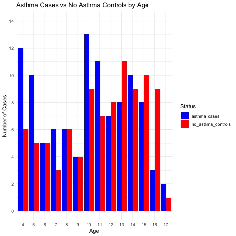
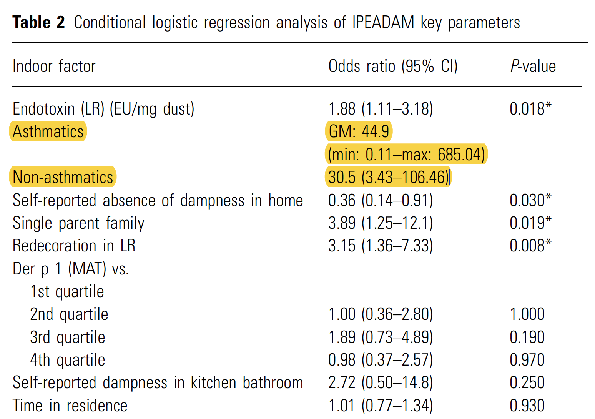
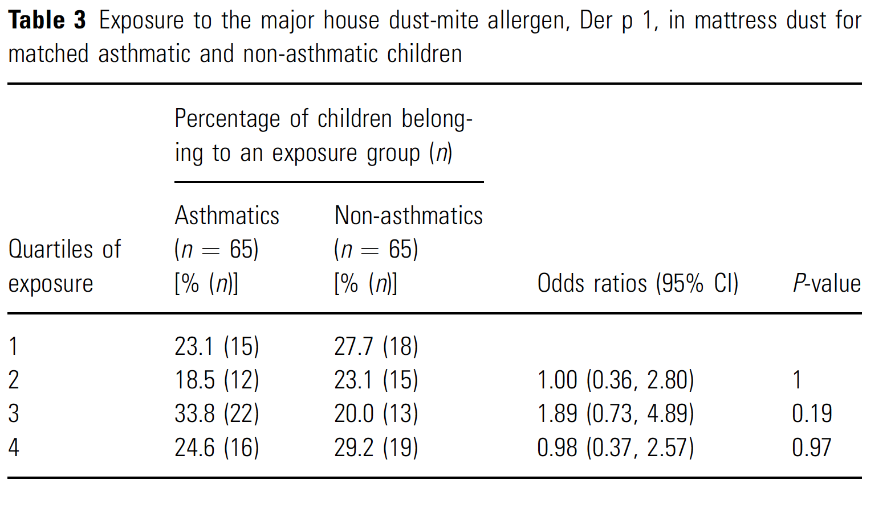
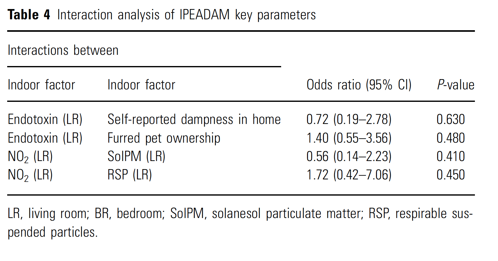

```{r echo=FALSE,  message=FALSE, warning=FALSE, include=FALSE, results='hide'}
knitr::opts_chunk$set(echo = FALSE)
options(scipen = 1, digits = 2)
pander::panderOptions('keep.trailing.zeros', TRUE)

library(here)
library(tidyverse)
library(knitr)
library(patchwork)
library(gt)

```


### Background
Here is a critical appraisal of this week's article. Recall that the goal is to not only improve critical appraisal skills but also to think about research questions, designs, and the necessary compromises that are often required in research. Hopefully this adds another dimension to typical journal clubs where either an article in uncritically endorsed enthusiastically or trashed unmercifully, although this is sometimes quite merited    
<br>
For reasons I am most unclear about, this week's selected article was the 2005 publication [Endotoxin exposure in asthmatic children and matched healthy controls: results of IPEADAM study](https://pubmed.ncbi.nlm.nih.gov/15926941/), Although not described as such, this was apparently a nested case-control study from a 1999 crosssectional study by the same [authors](https://www.ncbi.nlm.nih.gov/pmc/articles/PMC1313925/), of over 1500 completed questionnaires. Cases were children between the ages of 4 and 17 who had a study diagnosis of probable asthma. These <span style="color: red;">*asthmatic*</span> children were matched for sex, age and sib-ship size with children living in
asthma free households and the following main conclusions reported.
<br>
<br>
```{r out.width="110%"}
include_graphics("images/conclusions.png")
```

A critical analysis should consider bias and statistical issues

### Biases

It is helpful to consider biases in observational studies according to the following grouping     
- selection       
- misinformation           
- confounding      

#### Selection bias

[Selection bias](https://en.wikipedia.org/wiki/Selection_bias) is a distortion in the measure of association due to a sample selection such the measured association is not representative of what exists in the target population.

After identification of the research question, the next step is to consider which population is to be studied and in this study one can distinguish between several      
- target population (all children in the UK)     
- study population (all those with a chance of being in the study, ie the 1500 children who completed the original questionnaire)     
- sample population (the 200 children in Figure 1)     
- analyzed sample population (the 90 matched pairs of children)      

In their previous [work](https://www.ncbi.nlm.nih.gov/pmc/articles/PMC1313925/), the authors report an asthma prevalence of approximately 20%, or about 300 children.    
- Does the study population reflect the target population?    
- Do the 200 sample children reflect the total study population?    
- Do the 90 matched pairs, the analytical sample population reflect the overall sample population? What about the missing cases?      
<br>
<span style="color: red;">Many reasons to be concerned about possible selection bias in this study.  </span>            
Let's begin by examining their Figure 1 which is reproduced below.
<br>
<br>

```{r fig.align='center', out.width="75%"}

# week5.Rmd does the calculations - Define the data


```
<br>
<br>

How many asthma cases (and controls) did they identify in this Figure?       

The figure shows 105 cases and 93 controls, a total of 198 children. Yet the authors claim this figure shows the age distribution of 200 children. While the difference is small, it does raise further concerns about the reliability of their data analysis when there is a discordance in a simple counting of individuals.     
       
Why do they only use 90 cases? Presumably to meet their matching criteria, age (+/- 1 year). Below is the best matching I could create from their data.    


```{r fig.align='center', out.width="75%"}

# week5.Rmd does the calculations - Define the data
include_graphics("images/fig2.png")

```
<br>
<br>

The question then becomes why match?     
Most people think matching is to control for confounding but this is only partly true (and indeed may be more than offset by potential selection bias) and the best reason is to improve precision in situations of sparse data.      
Moreover, in this case a better alternative would have been not to match but to control for age in regression analysis as this would have allowed an estimation of the effect of age on the detection of asthma, while using the whole study sample of 198 children, including all 105 cases.     

```{r }
# Define the data
ages <- 4:17
no_asthma_controls <- c(6, 5, 5, 3, 6, 4, 9, 7, 8, 11, 9, 10, 9, 1)
asthma_cases <- c(12, 10, 5, 6, 6, 4, 13, 11, 7, 8, 10, 8, 3, 2)
# sum(asthma_cases) #105
# sum(no_asthma_controls) # 93

data <- data.frame(ages, asthma_cases,no_asthma_controls)
data_long <- gather(data,
                  key = "status",
                  value = "number",
                  -ages)

unmatched_cases <- c(1, 5, 2, 0, 2, 0, 1, 3, 0, 0, 0, 0, 0, 0)
m_asthma_cases <- asthma_cases - unmatched_cases
m_no_asthma_controls <- m_asthma_cases
m_data <- data.frame(ages, m_asthma_cases,m_no_asthma_controls)
m_data_long <- gather(m_data,
                    key = "status",
                    value = "number",
                    -ages)
g1 <- ggplot(data_long, aes(x=factor(ages), y=number, fill=status)) +
  geom_bar(stat="identity", position="dodge") +
  theme_minimal() +
  scale_y_continuous(limits = c(0, 14), breaks = c(0, 2, 4, 6, 8, 10,12,14)) +
  labs(x="Age", y="Number of Cases", fill="Status",
       title="Asthma Cases vs No Asthma Controls by Age") +
  scale_fill_manual(values=c("asthma_cases"="blue", "no_asthma_controls"="red"))

g2 <- ggplot(m_data_long, aes(x=factor(ages), y=number, fill=status)) +
  geom_bar(stat="identity", position="dodge") +
  theme_minimal() +
  scale_y_continuous(limits = c(0, 14), breaks = c(0, 2, 4, 6, 8, 10,12,14)) +
  labs(x="Age", y="Number of Cases", fill="Status",
       title="Matched Asthma Cases vs No Asthma Controls by Age", 
       subtitle="1:1 matching without replacements requires dropping 14 cases") +
  scale_fill_manual(values=c("m_asthma_cases"="blue", "m_no_asthma_controls"="red")) # Customize colors

data_long_uncount <- data_long %>% uncount(number) %>% 
  mutate(stat=ifelse(status=="no_asthma_controls",0,1))
out <- summary(glm(stat~ages, data = data_long_uncount, family = "binomial"))
ci <- exp(out$coefficients[2,1] + c(-1,1) * out$coefficients[2,2])
```

Performing logistic regression  `glm(stat~ages, data = data_long_uncount, family = "binomial")` shows that each year of additional age is associated with a odds ration decrease in asthma diagnosis = `r paste0("OR = ", round(exp(out$coefficients[2,1]),2), ", ", "95%CI ", round(ci[1],2), " - ", round(ci[2],2))`    

#### Misclassification

The authors don't report the raw data for the endotoxin exposure but assuming the following distribution among cases and controls gives an OR that approximates their results


```{r message=FALSE, warning=FALSE}
library(episensr)
misclassification(matrix(c(40, 50, 27, 63),
                          dimnames = list(c("Exposed+", "Exposed-"), c("Cases", "Controls")),
                         nrow = 2, byrow = TRUE),
                  type = "outcome",
                  bias_parms = c(1,1,1,1))
```

As the authors report from their previous work that their asthma detection questionnaire has only a 70% sensitivity and 91% specificity  <span style="color: red;">misclassification </span> is present.          
The effect of misclassification can be quantified using quantitative bias analysis (QBA) via the `episensr` package and `misclassification` function.  This seems an improvement over purely qualitative heuristics, such as "non-differential misclassification biases toward the null".        


```{r echo=TRUE, message=FALSE, warning=FALSE}
library(episensr)
misclassification(matrix(c(40, 50, 27, 63),
                          dimnames = list(c("Exposed+", "Exposed-"), c("Cases", "Controls")),
                         nrow = 2, byrow = TRUE),
                  type = "outcome",
                  bias_parms = c(.70,.70,.91,.91))
```

Conceptually, this misclassification of cases and controls suggest any association between indoor air pollutants and asthma will likely be underestimated and this analysis permits an estimate of the order of magnitude.

#### Confounding

How much residual or unmeasured confounding would be required to wipe out the observed effect? This can be determined using the `EValue` package as described in this [paper](https://pubmed.ncbi.nlm.nih.gov/28693043/).

```{r message=FALSE, warning=FALSE}
library(EValue)
evalues.OR(1.88, 1.11, 3.18, rare = FALSE)
```
This suggests that a moderate confounder with a risk of 2.1 fold to exposure and a 2.1 fold increase in the outcome would be required to eliminate the observed risk.          
In conclusion, there are multiple potential biases (selection, misclassification and confounding) associated with this study. Unmeasured confounding is unlikely to explain the observed association and misclassification suggest the association may be underestimated, but the inability to evaluate the magnitude and direction of the selection bias limits definitive determination of the direction of the bias assessment.   

### Analyses

The authors they performed a logistic regression where presumably probable asthma is the dependent variable. In this case understanding their table 2 is difficult.    

```{r out.width="50%"}

```
<br>
From Table 2 the authors make causal statements not only about endotoxins and asthma but also about other variables, including for example, dampness and single parent home.     
Making assertions based on regression coefficients from a multivariable analysis is subject to [Table 2 Fallacy](https://www.ncbi.nlm.nih.gov/pmc/articles/PMC3626058/). These covariate effect estimates may also be confounded even though the effect estimate for the main exposure is not confounded and their proper interpretation far from obvious.              
<br>
The authors state "There was no
difference in the levels of exposure to house dust major
allergen Der p 1, expressed in quartiles of exposure
between asthmatic and non-asthmatic matched controls
(Table 3)"


```{r out.width="50%"}

```
<br>
Looking at the confidence intervals we see they are very wide and, for example, don't exclude that for quartile 2 there is a 180% increase or 64% decrease in asthma prevalence compared to quartile 1. The authors have conflated ["**an absence of evidence with evidence of absence**"](https://pubmed.ncbi.nlm.nih.gov/7647644/).      
The authors make the same error in Table 4


```{r out.width="50%"}

```

<br>
when they conclude there are no interactions. The more reasonable conclusion being even if one ignores the potential biases, they lack sufficient power to draw conclusions about interactions.     

### Conclusion
A critical appraisal of this publication has shown several interesting avenues for discussion, perhaps explaining why it was suggested for review. Based on the critical appraisal it would seem there is little to support  their original conclusions.


