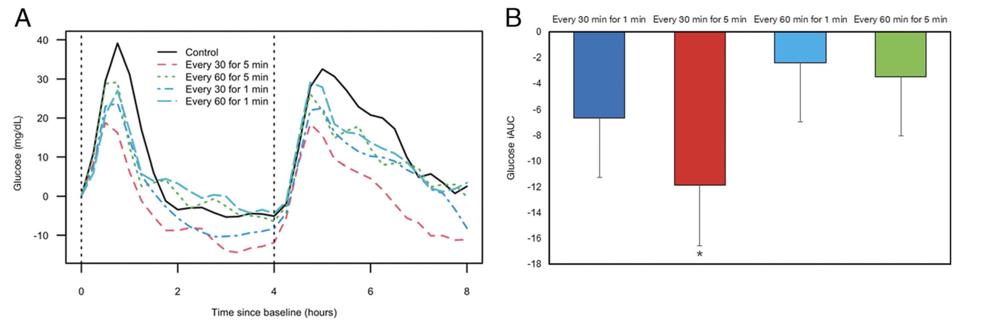
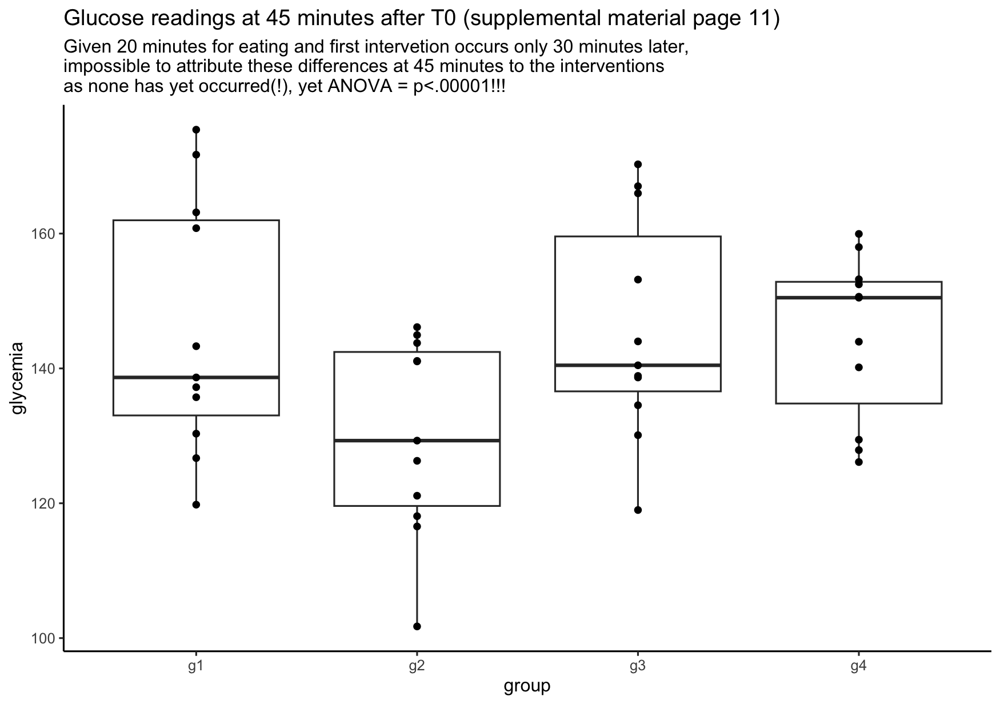
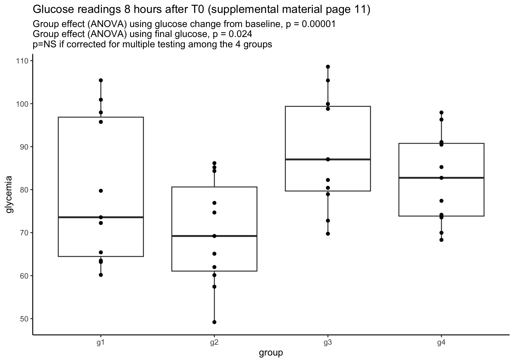

```{r echo=FALSE,  message=FALSE, warning=FALSE, include=FALSE, results='hide'}
knitr::opts_chunk$set(echo = FALSE)
options(scipen = 1, digits = 2)
pander::panderOptions('keep.trailing.zeros', TRUE)

library(here)
library(tidyverse)
library(knitr)
library(patchwork)
library(gt)

```

### Background

Recall that the goal of the 605 course is to not only improve critical appraisal skills, but also to think about research questions, designs, and the necessary compromises that are often required in research.
Hopefully this adds another dimension to typical journal clubs where either an article in uncritically endorsed enthusiastically or trashed unmercifully, although this is sometimes quite merited\
<br> This week's selected article was the 2023 publication [Breaking Up Prolonged Sitting to Improve Cardiometabolic Risk: Dose–Response Analysis of a Randomized Crossover Trial](https://pubmed.ncbi.nlm.nih.gov/36728338/) concluding

::: {style="color:red"}
The present study provides important information concerning efficacious sedentary break doses.
Higher-frequency and longer-duration breaks (every 30 min for 5 min) should be considered when targeting glycemic responses, whereas lower doses may be sufficient for BP lowering.
:::

In this paper, of 25 participants who attended a screening visit, 18 were randomized and 11 completed the randomized crossover designed study which investigated 5 different strategies to examine the acute effects of multiple doses of a light-intensity walking-based sedentary break intervention on cardiometabolic risk factors among middle- and older-age adults.
The trial conditions consisted of one uninterrupted sedentary (control) condition and four acute (experimental) conditions that entailed different sedentary break frequency/duration combinations: (1) light-intensity walking every 30 min for 1min, (2) light-intensity walking every 30 min for 5 min, (3) light-intensity walking every 60 min for 1 min, and (4) light-intensity walking every 60 min for 5 min.
As the largest response was for glucose differences, will restrict this commentary to that outcome.\
Before applying any reanalyzing of their data, let's just stop for a moment and ask ourselves the following question

::: {style="color:red"}
How likely do we think a study with only 11 individuals can detect meaningful glucose difference in glucose measurements with these anti sedentary strategies?
Would one expect the differences to be so large that they could be detected by this small a sample size?
:::

In any case, their conclusion appears supported by their published Figure 1 as shown here

```{r}

```

<br> This Figure is remarkable for 2 main points\
1.
The early separation between the control and intervention groups which appears maximum for 5 minutes exercise every 30 minutes\
2.
The outcome is not the glucose level from each randomized but the difference in level compared to the control (baseline) group.\       

<span style="color: red;">The early outcome difference  </span>         
In the supplemental material, the authors report summary glucose levels for each group at 15 minute intervals.
Using these values, we may simulate the glucose measurements for each group.
Let's consider the values at 45 minutes after T0.
Given the authors state that the first 20 minutes are assigned to a standardized meal and that no internvetion occurs before 30 minutes, any variation in the 45 minutes values can't be due to the intervention.
Yet, plotting an analyzing this data (ANOVA) reveals the following

```{r}
# simulation study for mystery paper #6
library(tidyverse)
set.seed(605)
#control group absolute values 
baseline <- rnorm(11, 86, 10)


# change at 45 minutes from baseline in supplemental material page 11
c_ctl_45=(rnorm(11,39.1,9.4)) + baseline
c_g1_45=(rnorm(11,23.8,7.0))
c_g2_45=(rnorm(11,16.2,8.6))
c_g3_45=(rnorm(11,27.0,6.0))
c_g4_45=(rnorm(11,29.2,9.9))

#  45 minutes outcome
# simulated dataframe for glucose - 11 individuals under the baseline & 5 treatment strategies 
df45 <- data.frame(id= rep(1:11), c_ctl_45=c_ctl_45, g1=c_ctl_45+c_g1_45,
                 g2=c_ctl_45+c_g2_45, g3=c_ctl_45+c_g3_45, g4=c_ctl_45+c_g4_45  )

# transform into long format for plotting purposes
df_long45 <- df45 %>%
  pivot_longer(!c(id,c_ctl_45), names_to = "group", values_to = "glycemia")
sum_anova <- summary(aov(glycemia~group + c_ctl_45 , data=df_long45)) # considers control difference 


# could also calculate the differences from baseline and then do anova which gives the identical result
df45_delta <- df45 |> 
  mutate(g1=g1-c_ctl_45, g2=g2-c_ctl_45, g3=g3-c_ctl_45, g4=g4-c_ctl_45) |> 
  dplyr::select(-c_ctl_45) |> 
  pivot_longer(!c(id), names_to = "group", values_to = "glycemia")
paste0("Analysis of variance using outcome of group glucose - control glucose")
summary(aov(glycemia~group, data=df45_delta)) 


fig1 <- ggplot(df_long45, aes(x=group,y=glycemia)) +
  geom_boxplot() +
  geom_point() +
  labs(title = "Glucose readings at 45 minutes after T0 (supplemental material page 11)", subtitle = "Given 20 minutes for eating and first intervetion occurs only 30 minutes later, 
impossible to attribute these differences at 45 minutes to the interventions \nas none has yet occurred(!), yet ANOVA = p<.00001!!!")+
  theme_classic()

# png("images/fig1test.png", width = 1000, height = 1000, family = "Arial")
# plot(fig1, digits = 2, base_size = 10)
# dev.off()


```

Finding these large differences even before any of the interventions could take effect should be a red flag for reservations about the final conclusions.     
<span style="color: red;">The outcome measure </span>      
Using the outcome measure as the difference in glucose levels between the active treatments strategies and the control (baseline) group is a potentially fatal flaw. The fatal flaw is using the difference from baseline as their outcome measure. [Bland and Altman](https://trialsjournal.biomedcentral.com/articles/10.1186/1745-6215-12-264) have published about why this "is biased and invalid, producing conclusions which are, potentially, highly misleading. The actual alpha level of this procedure can be as high as 0.50 for two groups and 0.75 for three". In short, we need to remember what is being randomized, it is the assignment to a given treatment strategy. Individuals are not randomized to their baseline glucose levels, any more than they are randomized to their weights, heights, eye color, or any other characteristic. With small sample sizes we may well expect that even in randomized samples, there may be meaningful differences in these characteristics, therefore including them as a component of the outcome is not appropriate and may bias the results.     
[Harrell](https://www.fharrell.com/post/errmed/) lists all the many assumptions required to be met before analyzing change from baseline could (potentially) be used.      
i.	the variable is not used as an inclusion/exclusion criterion for the study, otherwise regression to the mean will be strong       
ii.	if the variable is used to select patients for the study, a second post-enrollment baseline is measured and this baseline is the one used for all subsequent analysis      
iii.	the post value must be linearly related to the pre value      
iv.	the variable must be perfectly transformed so that subtraction “works” and the result is not baseline-dependent       
v.	the variable must not have floor and ceiling effects      
vi.	the variable must have a smooth distribution      
vii.	the slope of the pre value vs. the follow-up measurement must be close to 1.0 when both variables are properly transformed (using the same transformation on both)      

With this in mind, this study doesn't meet these assumptions (according to their CONSORT Fig 1, glucose was an entrance criteria, therefore possible regression to the mean may be present, glucose has a definite “floor effect”, and no proof that model is linear). 

To demonstrate the bias inherent in using change from baseline as opposed to final glucose reading alone, let’s again use the simulated data. We will analyze (ANOVA) and plot the outcome according to treatment where the outcome is i) the final glucose reading in each group or ii) ii) the change from baseline for each group.

```{r}
# 8 hour outcome
# from baseline in supplemental material page 11
set.seed(605)
baseline <- rnorm(11, 86, 10)


c_ctl=(rnorm(11,2.5,5.1)) + baseline
c_g1=(rnorm(11,-8.2,6.7))
c_g2=(rnorm(11,-11.1,6.6))
c_g3=(rnorm(11,3.5,3.0))
c_g4=(rnorm(11,-0.2,6.9))

# create a dataframe for the simulated glucose measuresments 11 individuals nunder the baseline & 5 treatment strategies
df <- data.frame(id= rep(1:11), c_ctl=c_ctl,  g1=c_ctl+c_g1,
                 g2=c_ctl+c_g2, g3=c_ctl+c_g3, g4=c_ctl+c_g4  )

# transform into long format for plotting and analysis purposes
df_long <- df %>%
  pivot_longer(!c(id,c_ctl), names_to = "group", values_to = "glycemia")

# anova for groups, glucose outcome for each group
sum1 <- summary(aov(glycemia~group, df_long))
# linear regression
sum2 <- summary(lm(glycemia~group , data=df_long))


# anova for group categories, using change from baseline as dependent variable
df_delta <- df |> 
  mutate(g1=g1-c_ctl, g2=g2-c_ctl, g3=g3-c_ctl, g4=g4-c_ctl) |> 
  dplyr::select(-c_ctl) |> 
  pivot_longer(!c(id), names_to = "group", values_to = "glycemia")

sum3 <- summary(aov(glycemia~group, data=df_delta))
# linear regression
sum4 <- summary(lm(glycemia~group , data=df_delta))

fig2 <- ggplot(df_long, aes(x=group,y=glycemia)) +
  geom_boxplot() +
  geom_point() +
  labs(title = "Glucose readings 8 hours after T0 (supplemental material page 11)", subtitle = "Group effect (ANOVA) using glucose change from baseline, p = 0.00001 \nGroup effect (ANOVA) using final glucose, p = 0.024 \np=NS if corrected for multiple testing among the 4 groups ")+
  theme_classic()


```

This suggests the original analysis is quite wrong and there is likely no difference between the strategies being tested. This is no surprise as with only 11 (or 9) subjects), even with a crossover design, the differences would have to be to very large to reach statistical significance. See the common sense response to the opening question above.    

There are some other additional discussion points to consider.       
1. While 18 subjects were randomized only 11 were analyzed and 2 of them had missing values. This raises the possibility of a non-quantifiable selection bias.      
2. The authors report a post-hoc power calculation, a statistically  inappropriate and nonsensical technique. If a nonsignificant finding was obtained, power will always be low to detect the observed effect size, as observed power is directly related to the obtained P value, with the former providing no additional information than the latter.     
3. There is no discussion of whether these measured outcomes have any clinical relevance. Suppose against all reason, the true glucose incremental area under the curve differential for the best treatment strategy was indeed the reported -11.8 mg% over 8 hours. This translated to 1.4 mg% / hour for an 8 hour day or 0.47 mg% / hour over 24 hours. How likely would this small (i.e. trivial) a difference have any meaningful clinical effect? Important to recall the adage   
<br>     
<span style="color: red;">**“Measure what is important and don’t make important what you can measure”**</span>    


